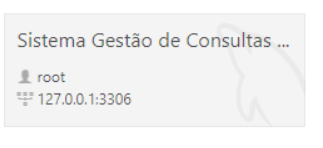
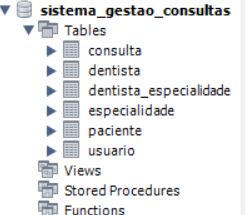
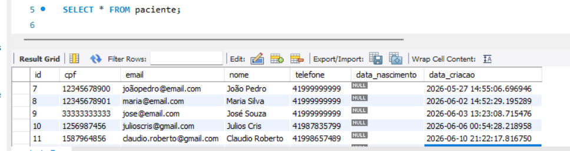

# 🦷 Alquimia Face Sorriso - Back-end

Sistema de gerenciamento para clínica odontológica, desenvolvido em **Angular**, com foco em organização de pacientes, dentistas, especialidades e consultas.

---

##  Tecnologias Utilizadas

* Java (versão 17 ou superior)
* Spring Boot (Spring Web, Spring Data JPA)
* Banco de Dados: MySQL / PostgreSQL 
* Maven (Gerenciador de dependências)

---

# 📸 Evidências do sistema







---

## Como Executar o Projeto

### Pré-requisitos
Antes de iniciar, certifique-se de ter instalado em sua máquina:
* [Java JDK 17+](https://www.oracle.com/java/technologies/downloads/)
* [Maven](https://maven.apache.org/) (opcional, caso prefira usar o `mvnw` incluso no projeto)
* Banco de dados configurado e rodando.

---

### Conexão com o Banco de Dados
Antes de rodar a aplicação, verifique as configurações em `src/main/resources/application.properties` e certifique-se de que as credenciais do seu banco local estejam configuradas:

```properties
spring.datasource.url=jdbc:mysql://localhost:3306/sistema_gestao_consultas
spring.datasource.username=sua_senha
spring.datasource.password=sua_senha

spring.jpa.hibernate.ddl-auto=update
spring.jpa.show-sql=true
spring.jpa.properties.hibernate.format_sql=true
 ```
---

## Passo a Passo para Rodar
Clone o repositório:

```bash
git clone https://github.com/Poerari/alquimia-face-sorriso-back.git
Acesse a pasta do projeto:
```

```Bash
cd alquimia-face-sorriso-back
Instale as dependências e compile o projeto:
```

```Bash
./mvnw clean install
(No Windows, utilize mvnw.cmd clean install)
```

# Execute a aplicação:

```Bash
./mvnw spring-boot:run
A API estará disponível e pronta para receber requisições em:
```
🔗 http://localhost:8080

### Endpoints da API
Abaixo estão as principais rotas configuradas no sistema para o Front-end consumir:

GET /api/pacientes - Listar todos os pacientes

POST /api/pacientes - Cadastrar um novo paciente

GET /api/dentistas - Listar todos os dentistas

POST /api/consultas - Agendar uma nova consulta

### Integração com o Front-end

Esta API foi desenvolvida para servir ao projeto front-end em Angular.
Repositório Front-end: Alquimia Face Sorriso - Front-end
Configuração de CORS: A API está configurada para permitir requisições vindas de http://localhost:4200 para garantir a comunicação perfeita com o ecossistema Angular.

### 👩‍💻 Desenvolvedora
Gabriela Poerari Baptista

### 📌 Observações Finais
Certifique-se de criar o banco de dados sistema_gestao_consultas no seu MySQL antes de rodar a aplicação pela primeira vez.
A porta padrão utilizada é a 8080. Se houver conflito com outro serviço, altere a propriedade server.port no seu arquivo application.properties.
